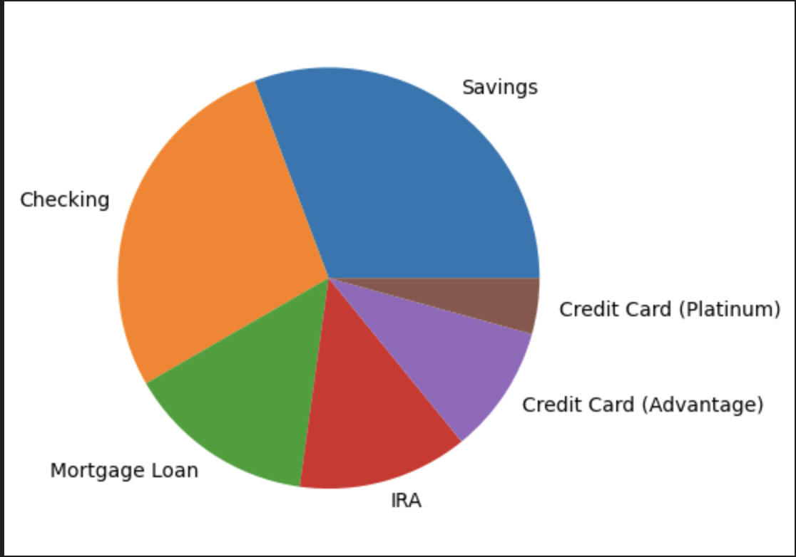
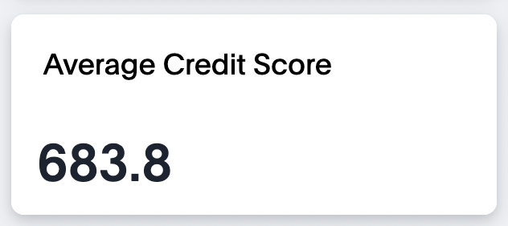
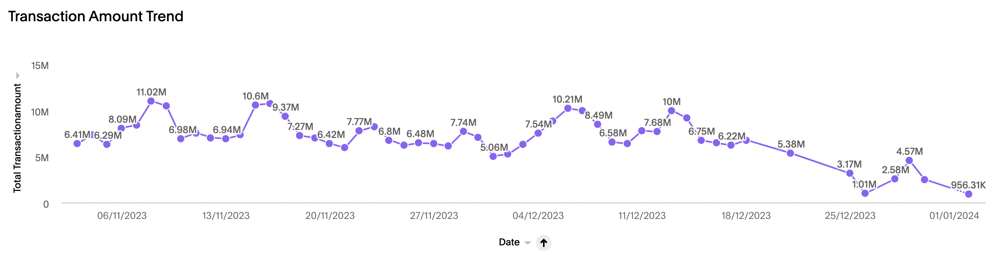
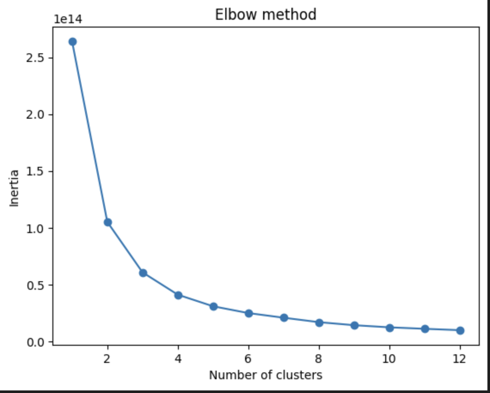
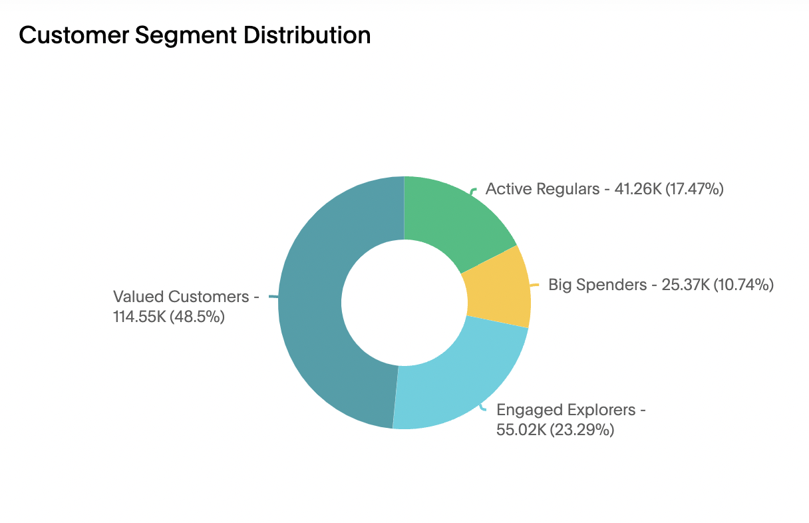
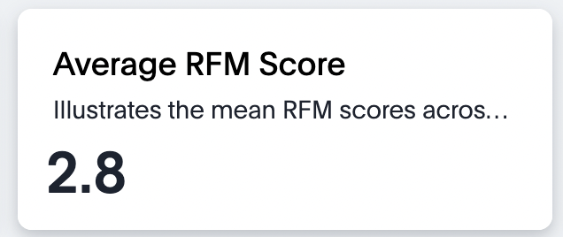
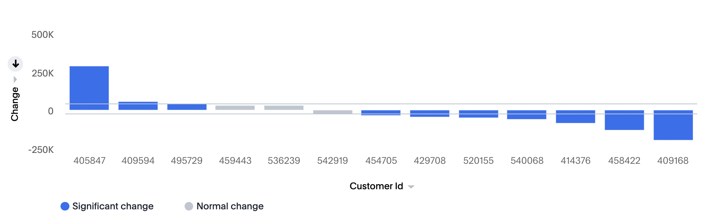

# Loyalty-classification and RFM Analysis with Snowflake and ThoughtSpot

Customer segmentation and loyalty classification play a crucial role in understanding and optimizing customer relationships. In this project, we leverage Banking and Transaction data to perform loyalty classification and RFM (Recency, Frequency, Monetary) analysis. The entire process is implemented using Snowflake Snowpark Python, and the results are visualized using ThoughtSpot.

## Overview

This repository contains the codebase for conducting loyalty classification and RFM analysis using Snowflake and ThoughtSpot. The process involves extracting valuable insights from Banking and Transaction data to classify customers based on their loyalty and conduct RFM analysis to understand their behavior.

## Approach

### Connection Establishment
We begin by establishing a connection to the Snowflake database using Snowpark Python.

### Data Selection

To kickstart our analysis, we meticulously select Retail Banking data and Customer Transaction data. These datasets form the foundation for our exploration into customer behavior and loyalty.

 

 

### Data Preparation

We embark on a process of cleaning and preparing the data, ensuring it's suitable for analysis. This step includes handling missing values, standardizing formats, merging various account data of each customer with transaction data, creating a comprehensive dataset of the customer's banking interactions.

### Loyalty Classification

Utilizing Snowflake Snowpark Python, we implement a robust loyalty classification algorithm. This algorithm assesses customer behavior, identifying patterns that help categorize customers into loyalty segments.

 

we employ a KMeans Clustering model to perform loyalty classification. To identify the optimal number of clusters, we evaluate inertias and leverage the elbow curve. The subsequent application of KMeans clustering unveils distinct customer segments based on their behaviors and interactions with the bank.

 

### RFM Analysis

Taking our analysis a step further, we meticulously evaluate the Recency, Frequency, and Monetary aspects of customer transactions. This analysis not only provides a snapshot of current customer engagement but also serves as a foundation for personalized and effective customer engagement strategies.

 

### Visualization with ThoughtSpot

To make the results accessible and actionable, we leverage ThoughtSpot for visualization. We establish a live Snowflake connection on ThoughtSpot and create worksheets using Snowflake tables. We then develop a liveboard on ThoughtSpot to dynamically visualize and interact with the loyalty classification and RFM analysis results.

## Results

The results of this analysis provide comprehensive insights into customer behavior, enabling data-driven decision-making for marketing, engagement, and loyalty strategies. The visualizations in ThoughtSpot enhance the interpretability of the findings, making it accessible for various stakeholders.

With SpotIQ change analysis, we can compare any two data points in a visualization for change and identify key change drivers from the underlying attribute columns. 

 

**For a detailed guide on executing the analysis and reproducing the results, please refer to the code and documentation in this repository.**

## Guide to use .tml files
For step-by-step instructions on how to import .tml files into your ThoughtSpot cluster please refer [How to use TML files](https://docs.thoughtspot.com/cloud/latest/scriptability#_how_to_use_tml_files)

**Note:** Ensure that you have the necessary credentials and permissions for Snowflake and ThoughtSpot to execute this analysis successfully.
